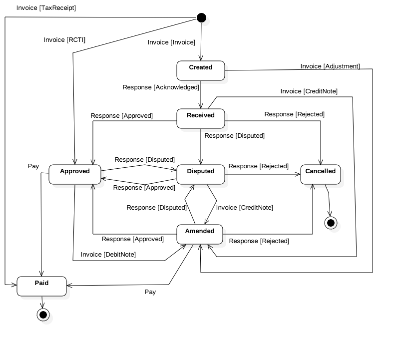

# Billing Process

## Invoice Document Profiles

The Invoice document is used in six different process contexts, indicated using the UBL ProfileID.

 * Standard invoice from seller to buyer ("ProfileID":"dbc:invoice")
 * Updated standard invoice from seller to buyer that replaces a pervious invoice of the same ID ("ProfileID":"dbc:adjustment")
 * Recipient created tax invoice from buyer to seller ("ProfileID":"dbc:rcti")
 * Tax receipt sent from seller to buyer after payment has been made - usually for POS or online purchases ("ProfileID":"dbc:taxreceipt")
 * Credit note sent from seller to buyer that references an earlier standard invoice ("ProfileID":"dbc:creditnote")
 * Debiit note sent from buyer to seller that references an earlier RCTI ("ProfileID":"dbc:debitnote")

The detailed business vlaidation rules for each invoice profile are defined in the billing rules specification.

## Document Response Codes

A UBL document response provides a means for the receiver party to update the sender on the processing state of the invoice.  The set of valid document response codes depends on the business process identified by the ProcessID (which is the same as the customizationID in UBL instances) are

 * Acknowledged - confirms receipt of the invoice (but does not imply approval to pay).
 * Approved - means that the payer has approved the invoice for (future) payment in accordance with payment terms.
 * Disputed - means that the payer has not accepted the inovice and will dispute some or all of the invoice.
 * Rejected - means that the payer has rejected the entire invoice and will not be paying.  

## State Lifecycle

The diagram shows the allowed set of states for an invoice as understood by both parties in the collaborative process.  Every transition from one state to another is triggered by the echange of a business message - which could be either an invoice (one of six profiles) or a response document (with one of four response codes).

 * The TaxReceipt has the simplest lifecycle because it is just a record of a previous payment and so there is only a single invoice (profileID=taxreceipt) sent from seller to buyer and the state is "paid".  No document response needed.
 * The receipt of an RCTI (profileID=rcti) by a seller from a buyer takes the state directly to "approved" because this is a payer initiated transaction.  However the payer may subsequently send an invoice (profileID=debitnote) to make an adjustment to the rcti prior to eventual payment is accordance with payment terms.
 * The standard inovice that is a demand for future payment from seller to buyer is the most complex lifecycle becuase there can be 
  - various response documents indicating buyer processing status (acknowledged, approved, disputed, rejected)
  - a re-issue of the invoice with changes (profileID = adjustment) from seller to buyer - usually in response to a disputed status.
  - an issue of a credit note against an existing invoice (profileID = creditnote) - also usually in response to a disputed status.
  - an outright rejection of the invoice by the buyer which leads to a cancelled end-state.
 * The "success" end state in all cases is "paid" - indicated by the receipt of a payment record from a bank reconcilation file (outside of the scope of this specificaiton).
